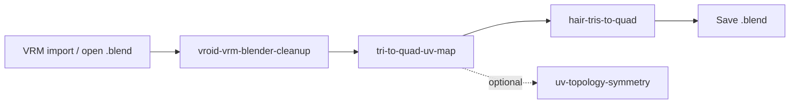
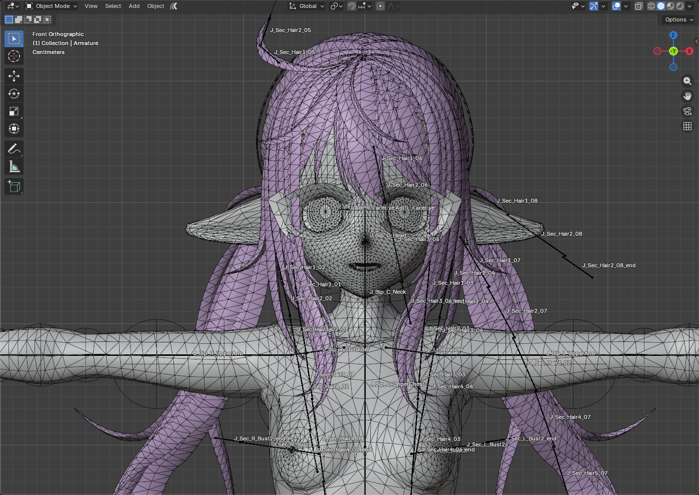
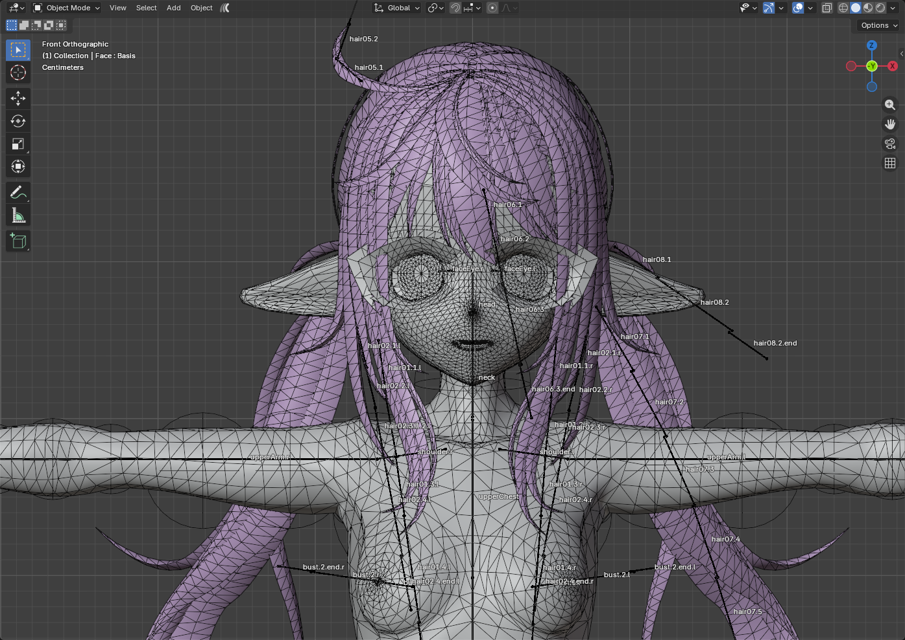
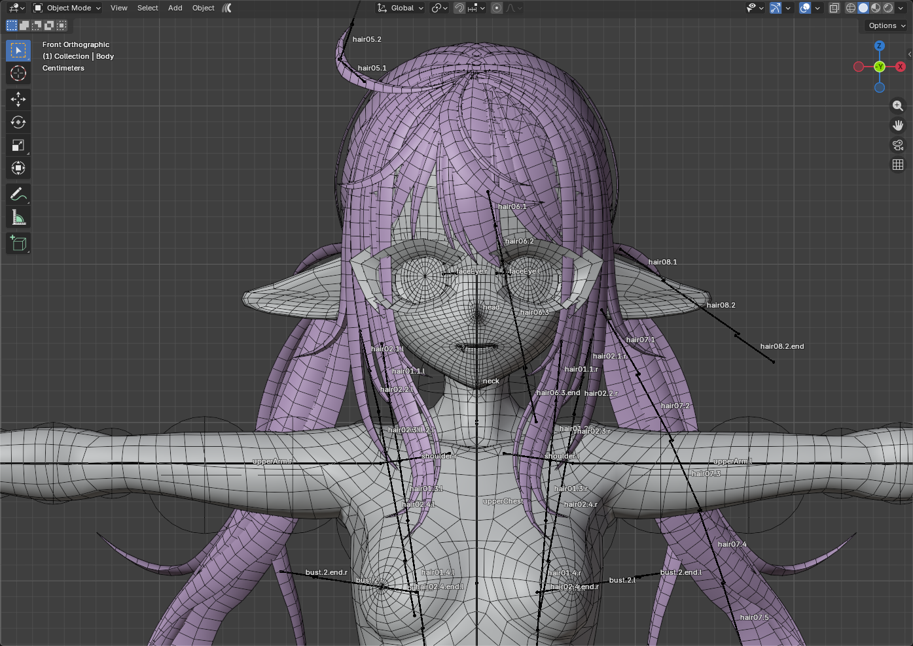

# blender-skills-and-rules

Cursor Agent skills and rules for VRoid/VRM avatar workflows in Blender — cleanup pipeline, tri→quad topology, MToon sync, and rig organization.

## Workflow overview

## Skills

All skills live under [`skills/`](skills/README.md). Start with:

1. **[vroid-vrm-blender-cleanup](skills/vroid-vrm-blender-cleanup/SKILL.md)** — full import cleanup (phases A–K)
2. **[tri-to-quad-uv-map](skills/tri-to-quad-uv-map/SKILL.md)** + **[hair-tris-to-quad](skills/hair-tris-to-quad/SKILL.md)** — topology after cleanup

See the [skills README](skills/README.md) for prerequisites, pipeline diagrams, profile list, MCP examples, and logging.

## Rules

- [`.cursor/rules/vroid-material-names.mdc`](.cursor/rules/vroid-material-names.mdc) — VRoid import vs workflow material naming (`Face.Skin`, `Hair.Back`, …)

## Example results

Viewport captures from a full **female** cleanup + tri→quad run (Front Orthographic, Blender 5.1):

| Stage | Screenshot |
|-------|------------|
| After cleanup (wireframe) |  |
| After cleanup (shaded, front ortho) |  |
| After tri→quad (shaded + wireframe) |  |

Files:

- [`docs/images/vroid-pipeline-after-cleanup-wireframe-front-ortho.png`](docs/images/vroid-pipeline-after-cleanup-wireframe-front-ortho.png)
- [`docs/images/vroid-pipeline-after-cleanup-shaded-front-ortho.png`](docs/images/vroid-pipeline-after-cleanup-shaded-front-ortho.png)
- [`docs/images/vroid-pipeline-after-tris-to-quad-shaded-front-ortho.png`](docs/images/vroid-pipeline-after-tris-to-quad-shaded-front-ortho.png)

## Requirements

- Blender with VRM add-on
- Blender MCP connected to Cursor
- Optional: Beyond Expressions (ARKit), Apply Modifiers With Shape Keys (Face normal transfer)
