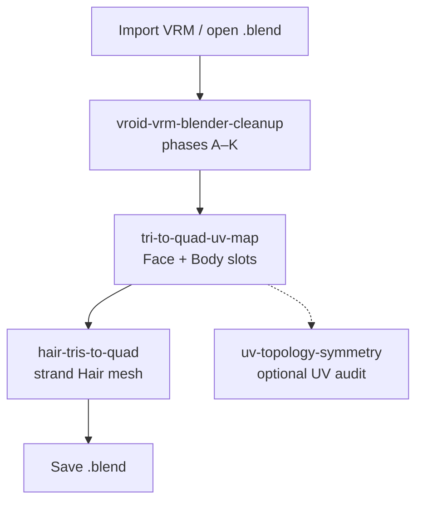
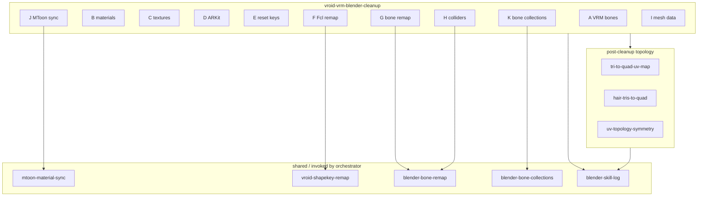
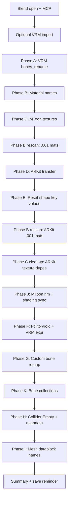
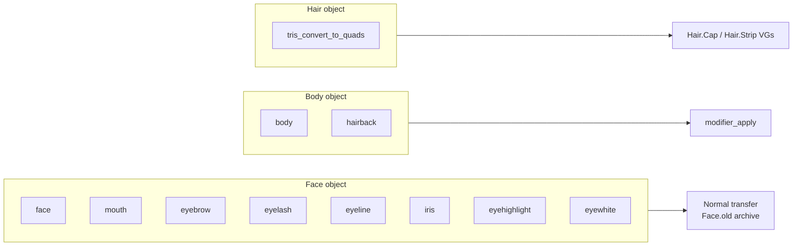
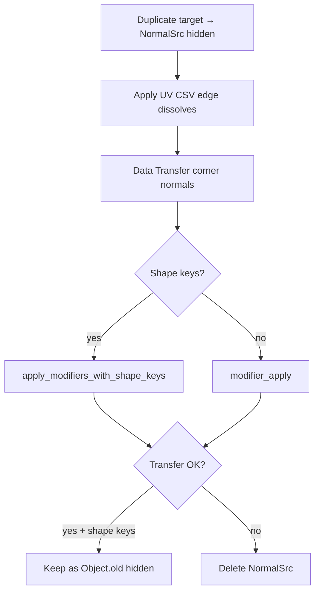
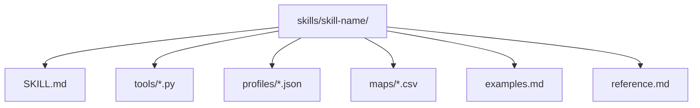
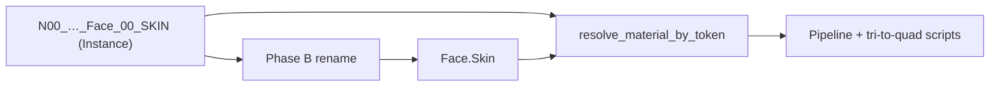
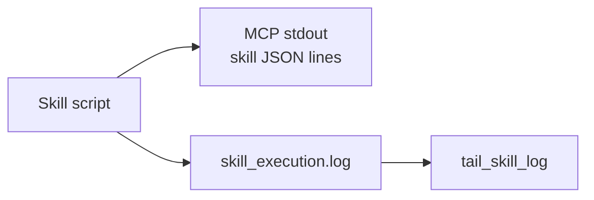

# Blender skills

Cursor Agent skills for VRoid/VRM avatar cleanup and topology work in Blender. Each skill is a folder with a `SKILL.md` (agent instructions), Python tools under `tools/`, and optional `profiles/` or `maps/` data.

Designed to run through **Blender MCP** (`execute_blender_code`) or from Blender’s Scripting workspace.

## Prerequisites

- Blender 4.x / 5.x with the **VRM Add-on** (humanoid bone rename, import)
- **Blender MCP** add-on connected to Cursor
- **Beyond Expressions** (optional) — ARKit shape key transfer in cleanup Phase D
- **Apply Modifiers With Shape Keys** (optional) — normal transfer on Face after tri→quad when shape keys are present

Point scripts at this repo’s `skills/` tree (not only `~/.cursor/skills`) so you get the latest tools:

```python
REPO_SKILLS = r"D:\MiraGameDev\blender-skills-and-rules\skills"
SKILL_TOOLS = os.path.join(REPO_SKILLS, "vroid-vrm-blender-cleanup", "tools")
```

## Typical workflow



Destructive steps use **dry-run first**, then apply after approval.

## Skill map



## Skills

| Skill | Role |
|-------|------|
| [vroid-vrm-blender-cleanup](vroid-vrm-blender-cleanup/SKILL.md) | **Main pipeline** — orchestrates phases A–K: VRM bones, workflow material names, MToon textures, ARKit transfer, shape key reset, MToon rim/shading sync, Fcl remap, bone remap, bone collections, colliders, mesh datablock names |
| [tri-to-quad-uv-map](tri-to-quad-uv-map/SKILL.md) | UV-keyed edge dissolve from CSV maps per material slot (`Face.Skin`, `Body.Skin`, `Hair.Back`, eyes, mouth, …). Shape-key normal transfer with hidden `{Object}.old` backup |
| [hair-tris-to-quad](hair-tris-to-quad/SKILL.md) | Strand `Hair` mesh — `tris_convert_to_quads` at 90°/90° plus `Hair.Cap` / `Hair.Strip` vertex groups |
| [mtoon-material-sync](mtoon-material-sync/SKILL.md) | Sync MToon 1.0 rim + Shading Toony from a reference material (default `Face.Skin`). Also cleanup **Phase J** |
| [vroid-shapekey-remap](vroid-shapekey-remap/SKILL.md) | `Fcl_*` → `vroid*` lower camelCase. Cleanup **Phase F** |
| [blender-bone-remap](blender-bone-remap/SKILL.md) | Custom bone naming (`.l`/`.r`, hair strands). Cleanup **Phase G** + collider rename **Phase H** |
| [blender-bone-collections](blender-bone-collections/SKILL.md) | Hair / Body / Clothing bone collections. Cleanup **Phase K** |
| [uv-topology-symmetry](uv-topology-symmetry/SKILL.md) | UV mirror audit and `TriQuad.*` vertex groups after tri→quad |
| [blender-skill-log](blender-skill-log/SKILL.md) | JSON-line execution log (`skill_execution.log`) and per-phase `elapsed_ms` |

### Cleanup pipeline (phases A–K)



| Phase | What |
|-------|------|
| A | VRM humanoid bone rename (`J_Bip_*` → `Hips`, `Spine`, …) |
| B | VRoid material names → workflow dot notation (`Face.Skin`, `Mouth.Face`, …) |
| C | MToon texture rename + write to disk |
| D | ARKit shape keys (requires `body_type`: `male` \| `female`) |
| E | Reset Face shape key values to 0 |
| J | MToon rim + shading sync |
| F | Fcl shape key remap |
| G | Custom bone remap |
| K | Bone collections |
| H | Collider Empty rename + metadata |
| I | Mesh datablock cleanup |

Phases B and C re-run after ARKit to catch `.001` duplicate materials.

### Tri→quad profiles

Run on **material slots**, not whole objects. On `Face`, run all eight face/eye profiles. On `Body`, run `body` then `hairback`. Use [hair-tris-to-quad](hair-tris-to-quad/SKILL.md) for the separate `Hair` strand object.



| Profile | Material token | Object |
|---------|----------------|--------|
| `face` | `Face.Skin` | Face |
| `mouth` | `Mouth.Face` | Face |
| `eyebrow` | `Brow.Face` | Face |
| `eyelash` | `Eyelash.Face` | Face |
| `eyeline` | `Eyeline.Face` | Face |
| `iris` | `Iris.Eye` | Face |
| `eyehighlight` | `EyeHighlight.Eye` | Face |
| `eyewhite` | `EyeWhite.Eye` | Face |
| `body` | `Body.Skin` | Body |
| `hairback` | `Hair.Back` | Body |

### Tri→quad apply flow (per profile)



## Folder layout



## Material naming

VRoid import names (`N00_000_00_Face_00_SKIN (Instance)`) are normalized to **workflow** names (`Face.Skin`) in Phase B. Pipeline scripts resolve either form via `resolve_material_by_token()` in `clean_vroid_material_names.py`.



See also the Cursor rule [vroid-material-names](../.cursor/rules/vroid-material-names.mdc).

## Running the full cleanup pipeline

```python
import os, importlib

REPO_TOOLS = r"D:\MiraGameDev\blender-skills-and-rules\skills\vroid-vrm-blender-cleanup\tools"
import run_full_pipeline as rfp
importlib.reload(rfp)
rfp.SKILL_TOOLS_DIR = REPO_TOOLS

result = rfp.run_full_pipeline(body_type="female", dry_run=True)   # audit
result = rfp.run_full_pipeline(body_type="female", dry_run=False)  # apply
```

## Running full tri→quad

```python
import os, sys

REPO = r"D:\MiraGameDev\blender-skills-and-rules\skills"
sys.path[:0] = [
    os.path.join(REPO, "tri-to-quad-uv-map", "tools"),
    os.path.join(REPO, "hair-tris-to-quad", "tools"),
]
import tri_to_quad_uv_map as tq
import hair_tris_to_quad as hq

for profile in ("face", "mouth", "eyebrow", "eyelash", "eyeline",
                "iris", "eyehighlight", "eyewhite"):
    tq.apply_profile(profile, target_obj="Face", dry_run=False)

for profile in ("body", "hairback"):
    tq.apply_profile(profile, target_obj="Body", dry_run=False)

hq.apply_tris_to_quads("Hair", dry_run=False)
```

## Execution logging



Pipeline and tri→quad tools emit `[skill]` JSON lines to stdout (captured by MCP) and append to:

`%APPDATA%\Blender Foundation\Blender\<version>\config\skill_execution.log`

Tail recent events from Blender:

```python
from blender_skill_log import tail_skill_log
tail_skill_log(20)
```

## Installing for Cursor

Copy or symlink this repo’s `skills/` folder into `~/.cursor/skills/`, or reference the repo path directly in MCP `execute_blender_code` blocks. Prefer the **repo path** when developing so Phase B resolver and timing changes are picked up immediately.
