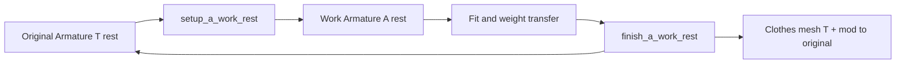

# Blender T ↔ A pose

Two different tools — do not mix:

| Mode | What changes | Use for |
|------|----------------|---------|
| **Pose Mode toggle** | Temporary pose only; **rest stays T** | Screenshots, quick fit look, export gate |
| **Weight-work A rest** | Duplicate armature+body; **work rest = A** | Pelvic/crotch weight transfer (thighs separated) |

Requires **Blender MCP** (`execute_blender_code`) unless run in Scripting workspace.

## Defaults

| | Arms | Legs |
|--|------|------|
| Pose Mode A | `35°` | `8°` |
| Weight-work A rest | `35°` | `30°` (overridable) |

Bone aliases (both modes): remapped `upperArm.l` / `upperLeg.l`, VRM `UpperArm_L`, or `J_Bip_*`.

---

## 1. Pose Mode toggle

| Pose | What |
|------|------|
| **T** | Clear `upperArm.*` + `upperLeg.*` pose rotation |
| **A** | Arms: local **Z** ±`angle_deg`. Legs: local **Z** spread ±`leg_spread_deg` |

Shoulders / forearms / lower legs unchanged. Stores `scene["ta_pose_state"]` as `"T"` or `"A"`.

```python
import os
import sys

SKILL_TOOLS = os.path.join(
    os.path.expanduser("~"), ".cursor", "skills", "blender-t-a-pose", "tools"
)
# Repo: skills/blender-t-a-pose/tools
sys.path.insert(0, SKILL_TOOLS)
import toggle_t_a_pose as ta

result = ta.detect_pose("Armature")
result = ta.toggle_t_a_pose("Armature")
result = ta.apply_a_pose("Armature", angle_deg=35, leg_spread_deg=8)
result = ta.apply_a_pose("Armature", include_legs=False)  # arms only
result = ta.apply_t_pose("Armature")
```

```
- [ ] detect — report T / A / other
- [ ] toggle or apply_t / apply_a
- [ ] verify — detect_pose again
```

---

## 2. Weight-work A rest (round-trip)

**Why:** T-rest thighs sit close; Data Transfer / weight paint bleeds across pelvis. Wide-leg **A rest** on a **work copy** separates the crotch for transfer. Original armature rest stays **T** for VRM export.



### Setup

1. Duplicate armature → `{name}.AWork` and body meshes with Armature mod targeting source
2. Retarget optional clothing to work armature (before rest change)
3. Force `pose_position=POSE`, pose arms/legs A
4. **Bake Armature modifier** into work/clothing mesh verts (work-body shape keys stripped on copy only)
5. **Apply Pose as Rest** on work armature → rest = A
6. Session stored in `scene["a_work_session"]` (JSON)

**Body shape keys:** expected none. If body has shape keys, setup returns `warnings` + `body_shape_keys` (still proceeds; strips keys on work copy only). Fix Body when possible.

### During work

- Clothing Armature modifier → **work** armature
- Weight transfer / paint from **work** body meshes

### Finish

1. Optionally apply Data Transfer / Vertex Weight* modifiers on clothing
2. Pose work armature with **negated** stored angles (A rest → T visual)
3. Apply Armature modifier on clothing (bake T mesh)
4. Re-add Armature modifier → **original** T armature
5. Delete work copies (`cleanup=True`); clear session

Clothing with **shape keys** fails finish (Apply Armature blocked) — remove/apply keys first or finish manually.

```python
import os
import sys

SKILL_TOOLS = os.path.join(
    os.path.expanduser("~"), ".cursor", "skills", "blender-t-a-pose", "tools"
)
sys.path.insert(0, SKILL_TOOLS)
import a_pose_weight_work as aw

result = aw.status_a_work_rest()
result = aw.setup_a_work_rest("Armature", dry_run=True)
result = aw.setup_a_work_rest(
    "Armature",
    body_object_names=["Body"],
    clothing_object_names=["Swimsuit"],
    angle_deg=35,
    leg_spread_deg=30,
)
# … fit / Data Transfer from work bodies onto clothing …
result = aw.finish_a_work_rest(["Skirt"], dry_run=True)
result = aw.finish_a_work_rest(["Skirt"], apply_weight_modifiers=True, cleanup=True)
```

```
- [ ] status — no open session
- [ ] setup_a_work_rest(arm, leg_spread_deg=30, ...)
- [ ] clothing Armature → work arm; weight transfer from work body
- [ ] finish_a_work_rest(clothing_names)
- [ ] verify original armature still T rest; export VRM
```

---

## Utility

| Script | Entrypoints |
|--------|-------------|
| [toggle_t_a_pose.py](tools/toggle_t_a_pose.py) | `detect_pose()`, `toggle_t_a_pose()`, `apply_t_pose()`, `apply_a_pose()` |
| [a_pose_weight_work.py](tools/a_pose_weight_work.py) | `setup_a_work_rest()`, `finish_a_work_rest()`, `status_a_work_rest()` |

## Bone name aliases

| Role | Names |
|------|-------|
| Upper arm L/R | `upperArm.l` / `.r`, `UpperArm_L` / `_R`, `J_Bip_L_UpperArm` / `_R_` |
| Upper leg L/R | `upperLeg.l` / `.r`, `UpperLeg_L` / `_R`, `J_Bip_L_UpperLeg` / `_R_` |
