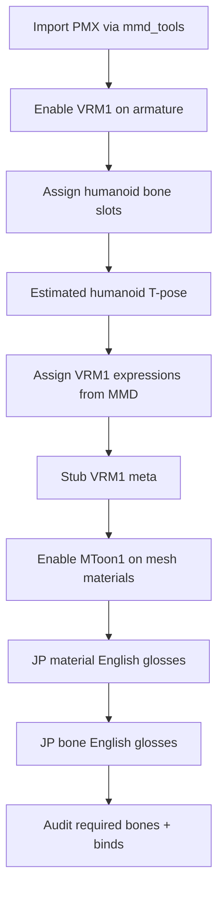

# MMD PMX → VRM1 setup

## When to use

- Import `.pmx` / `.pmd` and make armature **VRM 1.0–ready in Blender**
- Need humanoid bone slots + VRM1 expressions from MMD morphs
- **Do not** export `.vrm` in this skill — setup only

Requires **Blender MCP** (`execute_blender_code`) or Scripting workspace.

**Not** part of `run_full_pipeline()`. Do **not** run [vroid-vrm-blender-cleanup](../vroid-vrm-blender-cleanup/SKILL.md) after — that pipeline assumes VRoid naming.

## Prerequisites

- Blender 4.2+ with **MMD Tools** (`bpy.ops.mmd_tools.import_model`)
- **VRM Add-on for Blender** (`vrm_addon_extension`, assign humanoid / expression ops)

## Hard rules

- **No** `bpy.ops.export_scene.vrm` / no write `.vrm`
- **Keep** MMD JP bone name stem — may append ` (english)` gloss; do **not** rename to `J_Bip_*` / PascalCase
- **Keep** MMD shape keys — never rename, delete, or overwrite morph / shape-key datablocks (`まばたき`, `あ`, …). VRM1 expressions only **bind** to existing keys via `assign_vrm1_expressions_from_mmd`
- Dry-run first; apply only after user approval
- Prefer VRM Add-on auto-assign ops; JP/EN bone map is **fallback**

## Hard guarantee (shape keys)

- Snapshot mesh shape-key names **before** expression assign
- After assign: same names + same count (set equality). If drift → report `shapekeys_untouched: false` and list missing/added
- Do **not** bake, mix, or create replacement keys in this skill

## Workflow

```
Progress:
- [ ] 1. Confirm mmd_tools + VRM Add-on
- [ ] 2. Dry-run run_pmx_to_vrm1_setup(filepath=..., dry_run=True)
- [ ] 3. Review planned import + unmatched required humanoid slots
- [ ] 4. Apply dry_run=False
- [ ] 5. Re-audit; fix missing required bones if any; confirm `shapekeys_untouched`
- [ ] 6. Remind: export is manual / out of skill
- [ ] 7. User saves .blend
```

### Dry-run

```python
import os

SKILL_TOOLS = os.path.join(
    r"D:\MiraGameDev\blender-skills-and-rules",
    "skills",
    "mmd-pmx-to-vrm1",
    "tools",
)
_path = os.path.join(SKILL_TOOLS, "run_pmx_to_vrm1_setup.py")
_ns = {"__file__": _path}
exec(compile(open(_path, encoding="utf-8").read(), _path, "exec"), _ns)
run_pmx_to_vrm1_setup = _ns["run_pmx_to_vrm1_setup"]

result = run_pmx_to_vrm1_setup(
    filepath=r"D:\path\to\model.pmx",
    dry_run=True,
    scale=0.08,
)
# result["import"], result["setup"], result["audit"]
```

### Apply

```python
result = run_pmx_to_vrm1_setup(
    filepath=r"D:\path\to\model.pmx",
    dry_run=False,
    scale=0.08,
)
# result["armature_object_name"], result["audit"]["required_missing"]
```

### Audit only (already imported)

```python
exec(compile(open(os.path.join(SKILL_TOOLS, "audit_vrm1_setup.py"), encoding="utf-8").read(),
             os.path.join(SKILL_TOOLS, "audit_vrm1_setup.py"), "exec"), _ns)
audit = _ns["audit_vrm1_setup"](armature_object_name="...")
```

## Pipeline steps



| Step | Tool | Action |
|------|------|--------|
| Import | [import_pmx.py](tools/import_pmx.py) | `bpy.ops.mmd_tools.import_model` |
| VRM1 + humanoid + expr + meta + MToon | [setup_vrm1.py](tools/setup_vrm1.py) | Enable `spec_version="1.0"`; auto humanoid; fallback map; estimated T-pose (`make_estimated_humanoid_t_pose` + `humanoid.pose=currentPose`); `assign_vrm1_expressions_from_mmd` (**bind only**); meta; `mtoon1.enabled` + Lit Color white + alpha cutout (`MASK`); JP material + bone English glosses; shapekey before/after guard |
| Bone map fallback | [mmd_vrm1_bone_map.py](tools/mmd_vrm1_bone_map.py) | JP + EN (+ `.L`/`.R` / `_L`/`_R`) → VRM1 slots (matches bare or glossed names) |
| Material EN gloss | [rename_mmd_materials_en.py](tools/rename_mmd_materials_en.py) | `歯` → `歯 (teeth)` (keep JP; append gloss; skip ASCII-only) |
| Bone EN gloss | [rename_mmd_bones_en.py](tools/rename_mmd_bones_en.py) | `腕.L` → `腕.L (arm.L)` (keep JP; append gloss; 63-byte cap; update VRM humanoid refs) |
| Audit | [audit_vrm1_setup.py](tools/audit_vrm1_setup.py) | Required slots, expression binds, MToon count |
| Orchestrator | [run_pmx_to_vrm1_setup.py](tools/run_pmx_to_vrm1_setup.py) | `run_pmx_to_vrm1_setup()` |

## Utility tools

| Tool | Entrypoints |
|------|-------------|
| [run_pmx_to_vrm1_setup.py](tools/run_pmx_to_vrm1_setup.py) | `run_pmx_to_vrm1_setup()` |
| [import_pmx.py](tools/import_pmx.py) | `import_pmx()`, `resolve_pmx_path()`, `find_mmd_hierarchy()` |
| [setup_vrm1.py](tools/setup_vrm1.py) | `setup_vrm1_on_armature()` |
| [rename_mmd_materials_en.py](tools/rename_mmd_materials_en.py) | `rename_mmd_materials_with_english()` |
| [rename_mmd_bones_en.py](tools/rename_mmd_bones_en.py) | `rename_mmd_bones_with_english()` |
| [mmd_vrm1_bone_map.py](tools/mmd_vrm1_bone_map.py) | `apply_fallback_humanoid()`, `plan_fallback_humanoid()` |
| [audit_vrm1_setup.py](tools/audit_vrm1_setup.py) | `audit_vrm1_setup()` |

## Additional reference

- Bone table + ops + caveats: [reference.md](reference.md)
- MCP examples: [examples.md](examples.md)

## Out of scope unless asked

- Exporting `.vrm`
- Rigid body / joint → spring bone conversion
- [vroid-vrm-blender-cleanup](../vroid-vrm-blender-cleanup/SKILL.md) phases A–K
- [mtoon-material-sync](../mtoon-material-sync/SKILL.md) theme compile
- Topology / ARKit / Phase G bone remap
- Renaming or deleting MMD shape keys / morphs
- Opposite direction ([arkit-vroid-mmd-shapekeys](../arkit-vroid-mmd-shapekeys/SKILL.md))
