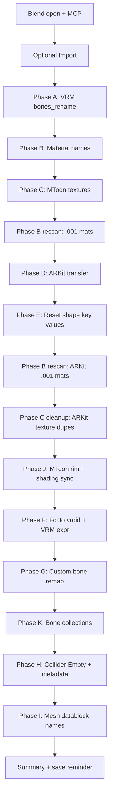

# VRoid VRM Blender cleanup (full pipeline A–K)

## When to use

- **Full pipeline:** one invocation runs **A → B → C → (B rescan) → D → E → (B + C cleanup rescan) → J → F → G → K → H → I**
- **Import** optional when a `.blend` is already open
- **Partial runs:** single phases via `run_phase_a()` … `run_phase_i()` or `phases={...}` on the orchestrator
- Cleaning VRoid-exported materials, textures, bones, shape keys, colliders, mesh data names

Requires **Blender MCP** (`execute_blender_code`) unless the user runs scripts in the Scripting workspace.

Related skills (invoked by orchestrator or manually):

- **vroid-shapekey-remap** — umbrella **Phase F** (`Fcl_*` → `vroid*`)
- **blender-bone-remap** — umbrella **Phase G** (bones) + **Phase H** (colliders)
- **blender-bone-collections** — umbrella **Phase K** (Hair / Body / Clothing bone collections)
- **mtoon-material-sync** — umbrella **Phase J** (rim + shading parametric sync)
- **blender-skill-log** — execution logging to `config/skill_execution.log` (auto from orchestrator)

## Execution logging

`run_full_pipeline()` logs `pipeline_start`, `phase_done`, and `pipeline_end` via [blender-skill-log](../blender-skill-log/SKILL.md). MCP captures each line in `stdout`; tail history with `tail_skill_log()`.

## Full pipeline (primary entry)

```python
import os

# Prefer this repo's tools when present; else ~/.cursor/skills copy
SKILL_TOOLS = os.path.join(
    os.path.expanduser("~"), ".cursor", "skills", "vroid-vrm-blender-cleanup", "tools"
)
REPO_TOOLS = r"D:\MiraGameDev\blender-skills-and-rules\skills\vroid-vrm-blender-cleanup\tools"
if os.path.isdir(REPO_TOOLS):
    SKILL_TOOLS = REPO_TOOLS

_pipeline_path = os.path.join(SKILL_TOOLS, "run_full_pipeline.py")
_pipeline_ns = {"__file__": _pipeline_path}
exec(compile(open(_pipeline_path, encoding="utf-8").read(), _pipeline_path, "exec"), _pipeline_ns)
run_full_pipeline = _pipeline_ns["run_full_pipeline"]
run_full_pipeline.SKILL_TOOLS_DIR = SKILL_TOOLS
```

# Dry-run entire pipeline (audit only)
result = run_full_pipeline(body_type="female", dry_run=True)

# Apply after user approval
result = run_full_pipeline(body_type="female", dry_run=False)
```

**With import:**

```python
result = run_full_pipeline(
    import_filepath=r"D:\path\to\avatar.vrm",
    body_type="female",
    dry_run=False,
)
armature_object_name = result["armature_object_name"]
face_mesh_object_name = result["face_mesh_object_name"]
```

**Skip ARKit only** (runs A→B→C→J→F→G→H→I):

```python
result = run_full_pipeline(skip_arkit=True, dry_run=False)
```

**Partial phases** (Phase **A** always required if included):

```python
result = run_full_pipeline(phases={"A", "B", "C"}, dry_run=True)
```



### Agent rules

- Full order: **A → B → C → (B rescan) → D → E → (B rescan + C ARKit texture cleanup) → J → F → G → K → H → I**
- **Never skip Phase A** in full pipeline; reject `phases` sets omitting `"A"`
- **Never guess `body_type`** — required for D/E (`male` | `female`)
- If no `body_type`: run **A→B→C→J→F→G→K→H→I**, skip D/E with reason
- Every destructive step: **dry-run → stop for approval → apply → verify**
- Remind user to **save .blend** after Phase C (disk textures) and at end

## Progress checklist

```
- [ ] phase-import — Load .vrm (skip if .blend already open)
- [ ] phase-a-bones — VRM Add-on bones_rename (mandatory)
- [ ] phase-b-materials — Strip N00_* material prefixes
- [ ] phase-c-textures — MToon texture audit → apply → verify
- [ ] phase-b-rescan — Re-run material rename for `.001` mats after C and after ARKit
- [ ] phase-c-arkit-cleanup — Merge legacy `.001` texture datablocks on ARKit duplicate materials
- [ ] phase-j-mtoon-sync — Sync rim + Shading Toony from face reference (not Shading Shift)
- [ ] phase-d-arkit — Beyond Expressions ARKit (male/female required)
- [ ] phase-e-reset — Zero Face shape key values (only after D)
- [ ] phase-f-shapekeys — Fcl_* → vroid* + VRM expression binds
- [ ] phase-g-bones — Custom bone remap (2-pass + hair mirror)
- [ ] phase-h-colliders — Collider Empties + collider_display_name
- [ ] phase-i-mesh — Clean (merged) / .baked mesh datablock names
```

## Phase map (A–K)

| Phase | Required? | Script | What |
|-------|-----------|--------|------|
| Import | Optional | [import_vrm.py](tools/import_vrm.py) | Load `.vrm`; sets armature / Face names |
| **A** | **Yes** | [vrm_bones_rename.py](tools/vrm_bones_rename.py) | `J_*` → VRM humanoid (`Hips`, `UpperLeg_L`, …) |
| **B** | Yes | [clean_vroid_material_names.py](tools/clean_vroid_material_names.py) | Strip `N00_*`; **re-run once** after C for `.001` mats |
| **C** | Yes | [rename_mtoon_textures.py](tools/rename_mtoon_textures.py) | Texture datablocks + disk PNGs; **ARKit dup cleanup** after D |
| **D** | If ARKit | [transfer_arkit_shapekeys.py](tools/transfer_arkit_shapekeys.py) | Beyond Expressions ARKit |
| **E** | If D applied | [reset_shape_keys.py](tools/reset_shape_keys.py) | Zero Face shape key values |
| **J** | Yes | [sync_mtoon_attributes.py](../mtoon-material-sync/tools/sync_mtoon_attributes.py) | Rim + Shading Toony sync from reference mat; **Shading Shift stays per-material** |
| **F** | Yes | [remap_shapekeys.py](../vroid-shapekey-remap/tools/remap_shapekeys.py) | `Fcl_*` → `vroid*` + VRM expression binds |
| **G** | Yes | [remap_bones.py](../blender-bone-remap/tools/remap_bones.py) | Custom bone remap 2-pass + hair mirror (**requires A**) |
| **H** | Yes | [rename_vrm_colliders.py](../blender-bone-remap/tools/rename_vrm_colliders.py) | Collider Empties + `collider_display_name` |
| **I** | Yes | [clean_mesh_datablocks.py](tools/clean_mesh_datablocks.py) | Strip `(merged)` / `.baked` from mesh data names |

## Before changing anything

1. **Blender open** with MCP connected (empty file OK if starting with Import).
2. **MCP green** in Cursor Settings → MCP → `blender`.
3. **Import or open:** user gives a `.vrm` path / directory, or an existing `.blend` is loaded.
4. **Ask** scope when unclear. Default: full pipeline via `run_full_pipeline()`.
5. **Do not guess male/female** for Phase D.

## MCP execution pattern

Set `SKILL_TOOLS` to this skill’s `tools/` folder (personal: `~/.cursor/skills/vroid-vrm-blender-cleanup/tools`; repo: `skills/vroid-vrm-blender-cleanup/tools`).

Store `armature_object_name` and `face_mesh_object_name` from import audit or orchestrator result.

### Phase Import — VRM from path or directory

Skip when the user only wants cleanup on an **already-open** `.blend`.

```python
exec(open(os.path.join(SKILL_TOOLS, "import_vrm.py")).read())
result = run_phase_import(filepath=r"D:\path\to\avatar.vrm", new_file=True, dry_run=False)
armature_object_name = result.get("armature_object_name") or "Armature"
face_mesh_object_name = result.get("face_mesh_object_name") or "Face"
```

If multiple `.vrm` in a folder, use **AskQuestion** before import.

### Phase A — VRM bone rename (mandatory)

Requires **VRM Add-on for Blender** enabled.

```python
exec(open(os.path.join(SKILL_TOOLS, "vrm_bones_rename.py")).read())
result = run_phase_a(armature_object_name=armature_object_name, dry_run=True)
# After approval:
result = run_phase_a(armature_object_name=armature_object_name, dry_run=False)
```

Runs `bpy.ops.vrm.bones_rename` — VRM humanoid names, not the custom rules in Phase G.

### Phase B — materials

VRoid **source** names (e.g. `N00_000_00_Face_00_SKIN (Instance)`) are renamed to **workflow** names (e.g. `Face.Skin`). Use workflow names in scripts; `resolve_material_by_token()` bridges source ↔ workflow via `scene["vroid_material_rename_map"]`.

```python
exec(open(os.path.join(SKILL_TOOLS, "clean_vroid_material_names.py")).read())
result = run_phase_b(dry_run=True)
result = run_phase_b(dry_run=False)  # after approval
```

Re-run Phase B once after Phase C to catch `.001` materials that still carry `N00_*`.

### Phase C — MToon textures

```python
exec(open(os.path.join(SKILL_TOOLS, "rename_mtoon_textures.py")).read())
audit = audit_mtoon_textures()
result = apply_mtoon_texture_renames(audit["rename_map"])
verify = verify_mtoon_textures()
# Or: run_phase_c(step="audit" | "apply" | "verify" | "arkit_cleanup_audit" | "arkit_cleanup")
```

After ARKit (Phase D), duplicate `.001` materials reference legacy texture datablocks (`Shader_NoneBlack.001`, `_01.001`, …). The pipeline runs `cleanup_arkit_texture_duplicates()` automatically — rewires slots on `.001` materials to canonical images and removes unused datablocks.

```python
audit = audit_arkit_texture_duplicates()
result = cleanup_arkit_texture_duplicates(dry_run=False)
```

Remind user to **save .blend** before apply (disk PNG renames).

### Phase D — ARKit shape keys (Beyond Expressions)

**Gates:** user said **male** or **female**; `beyond_expressions_ready()["ready"]` is true.

```python
exec(open(os.path.join(SKILL_TOOLS, "transfer_arkit_shapekeys.py")).read())
result = run_phase_d(body_type="female", face_mesh_name=face_mesh_object_name, dry_run=True)
result = run_phase_d(body_type="female", face_mesh_name=face_mesh_object_name, dry_run=False)
```

### Phase E — reset shape keys (after D only)

```python
exec(open(os.path.join(SKILL_TOOLS, "reset_shape_keys.py")).read())
result = run_phase_e(mesh_name=face_mesh_object_name, dry_run=False, phase_d_result=phase_d_result)
```

### Phase J — MToon rim + shading sync

Runs **after** material rename, texture cleanup, and ARKit material rescans. Default reference token: `Face.Skin` (match material name containing that string).

```python
MTOON_TOOLS = os.path.join(
    os.path.expanduser("~"), ".cursor", "skills", "mtoon-material-sync", "tools"
)
exec(open(os.path.join(MTOON_TOOLS, "sync_mtoon_attributes.py"), encoding="utf-8").read())
result = run_phase_j(reference_material="Face.Skin", dry_run=True)
result = run_phase_j(reference_material="Face.Skin", dry_run=False)
```

Or via orchestrator:

```python
result = run_full_pipeline(
    reference_material="Face.Skin",
    dry_run=False,
)
```

See **mtoon-material-sync** skill for `groups=["rim"]` / `include_outline=True`.

### Phase F — Fcl shape key rename

Loads sibling skill from repo or `~/.cursor/skills/vroid-shapekey-remap/tools`.

```python
SHAPEKEY_TOOLS = os.path.join(
    os.path.expanduser("~"), ".cursor", "skills", "vroid-shapekey-remap", "tools"
)
exec(open(os.path.join(SHAPEKEY_TOOLS, "remap_shapekeys.py")).read())
result = remap_object_fcl_keys(
    face_mesh_object_name,
    dry_run_only=True,
    armature_object_name=armature_object_name,
)
result = remap_object_fcl_keys(
    face_mesh_object_name,
    fix_vrm_expression_binds=True,
    armature_object_name=armature_object_name,
)
```

### Phase G — custom bone remap

Requires Phase A first (`J_Bip_*` bones must be VRM humanoid names).

```python
BONE_TOOLS = os.path.join(
    os.path.expanduser("~"), ".cursor", "skills", "blender-bone-remap", "tools"
)
exec(open(os.path.join(BONE_TOOLS, "remap_bones.py")).read())
# Build mapping, dry_run_mapping, apply_mapping × 2 (pass 1 + hair mirror pass 2)
```

See **blender-bone-remap** skill for full mapping rules.

### Phase K — bone collections (Hair / Body / Clothing)

Runs **after Phase G** so remapped `hair*` / `hood*` names classify correctly.

```python
BC_TOOLS = os.path.join(
    os.path.expanduser("~"), ".cursor", "skills", "blender-bone-collections", "tools"
)
exec(open(os.path.join(BC_TOOLS, "assign_bone_collections.py")).read())
audit = audit_bone_collections(armature_object_name=armature_object_name)
result = apply_bone_collections(armature_object_name=armature_object_name, dry_run=False)
```

See **blender-bone-collections** skill for classification rules.

### Phase H — collider rename

```python
exec(open(os.path.join(BONE_TOOLS, "rename_vrm_colliders.py")).read())
audit = audit_vrm_colliders(armature_object_name=armature_object_name)
result = apply_vrm_collider_renames(armature_object_name=armature_object_name)
```

### Phase I — mesh datablock names

```python
exec(open(os.path.join(SKILL_TOOLS, "clean_mesh_datablocks.py")).read())
audit = audit_mesh_datablock_names()
result = clean_mesh_datablock_names(dry_run=False)
```

Strips `(merged)` and `.baked` suffixes; optionally aligns mesh data name to object name. Face skin-only mesh data (UV region extracted from the Face object) should be named **`Face.Skin`** — separate from the multi-slot `Face` object on import.

## End summary — ARKit follow-up

When Phase **D** was skipped because the user **did not specify male or female**, include an ARKit follow-up before closing:

1. Run `beyond_expressions_ready()` and report status.
2. Ask: Beyond Expressions enabled? Apply ARKit? **Male or female?**
3. If yes + gender: re-run D → E on the Face mesh.

Skip this follow-up if D already ran in the same session.

## Phase summaries

**A:** VRM Add-on `bones_rename` — `J_Bip_*` → PascalCase humanoid bones.

**B:** Strips VRoid import prefix + ` (Instance)`; standardizes to workflow dot names (`Face_00_SKIN` → `Face.Skin`). Stores alias map on scene.

**C:** Image datablocks, `img.filepath`, disk files under `//textures/`. Full tables: [reference.md](reference.md).

**D:** Beyond VRM Extension Suite — `bpy.ops.vrm.transfer_shapekeys()` with `VROID_Female_Face` / `VROID_Male_Face`.

**E:** Zeros shape key **values** on Face — only after successful D.

**J:** Copies MToon rim + **Shading Toony** from reference. Does **not** copy Shading Shift (face vs body/hair differ).

**F:** `Fcl_*` → `vroid*` rename + VRM0 expression bind `index` field updates.

**G:** Lowercase bone convention, hair mirror pairs, vertex groups + F-curves.

**H:** `J_Bip_*_collider_N` Empty objects → `{bone}_collider_N`; sync `collider_display_name`.

**I:** `Body (merged)` → `Body`; orphan baked mesh data cleanup.

## MCP troubleshooting

| Symptom | Fix |
|---------|-----|
| `MCP server does not exist: blender` | Settings → MCP → restart `blender`; new chat |
| `import_scene.vrm` missing | Enable VRM Add-on for Blender |
| `transfer_shapekeys` missing | Enable Beyond VRM Extension Suite |
| Phase D skipped | User did not specify male/female, or Beyond addon not ready |
| Phase E skipped | Phase D was not applied |
| Phase G blocked | Run Phase A first — `J_Bip_*` bones still present |
| Phase J skipped | `mtoon-material-sync` skill not installed / script missing |
| Phase K skipped | `blender-bone-collections` skill not installed / script missing |
| Multiple `.vrm` in folder | AskQuestion; pass `filename=` to import |

## Out of scope unless asked

- Per-material Shade Color tint edits (Phase J syncs rim/shading params only)
- VRM re-export validation
- VRM1 expression auto-assign beyond bind index fix in Phase F

## Utility tools

| Tool | Entrypoints |
|------|-------------|
| [run_full_pipeline.py](tools/run_full_pipeline.py) | `run_full_pipeline()` — orchestrates A–K |
| [import_vrm.py](tools/import_vrm.py) | `list_vrm_files()`, `run_phase_import()`, `audit_after_import()` |
| [vrm_bones_rename.py](tools/vrm_bones_rename.py) | `run_phase_a()` — Phase **A** |
| [clean_vroid_material_names.py](tools/clean_vroid_material_names.py) | `run_phase_b()` — Phase **B** |
| [rename_mtoon_textures.py](tools/rename_mtoon_textures.py) | `run_phase_c()`, `cleanup_arkit_texture_duplicates()`, … — Phase **C** |
| [check_beyond_expressions.py](tools/check_beyond_expressions.py) | `beyond_expressions_ready()` |
| [transfer_arkit_shapekeys.py](tools/transfer_arkit_shapekeys.py) | `run_phase_d()` — Phase **D** |
| [reset_shape_keys.py](tools/reset_shape_keys.py) | `run_phase_e()` — Phase **E** |
| [clean_mesh_datablocks.py](tools/clean_mesh_datablocks.py) | `audit_mesh_datablock_names()`, `clean_mesh_datablock_names()` — Phase **I** |

Phases **F**, **G**, **H**, **J** live in sibling skills (see phase table). Worked examples: [examples.md](examples.md).

Return structured `result` dicts from MCP code (assign `result = ...` after exec).
