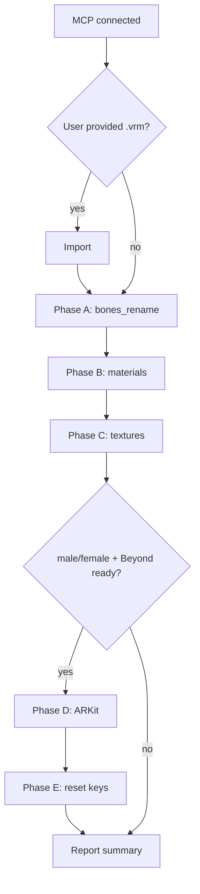

# VRoid VRM Blender cleanup — reference

## Phase Import — VRM file

| Item | Notes |
|------|-------|
| Add-on | VRM Add-on for Blender (`import_scene.vrm`) |
| Input | `.vrm` filepath, or directory (user picks if multiple) |
| Default | `new_file=True` — `read_homefile(use_empty=True)` then import |
| Script | `tools/import_vrm.py` — `list_vrm_files`, `run_phase_import`, `audit_after_import` |

Default import kwargs (`DEFAULT_IMPORT_KWARGS`):

- `use_addon_preferences=True`
- `extract_textures_into_folder=False`
- `make_new_texture_folder=True`
- `set_shading_type_to_material_on_import=True`
- `set_view_transform_to_standard_on_import=True`
- `set_armature_display_to_wire=True`
- `set_armature_display_to_show_in_front=True`
- `set_armature_bone_shape_to_default=True`
- `enable_mtoon_outline_preview=True`

After import, use `audit["primary_armature"]` and `audit["primary_face_mesh"]` for phases A, D, E.

Skip Import when the avatar is already loaded in an open `.blend`.

## Phase A — VRM Add-on bone rename

Run first, before material or texture cleanup. Tool: [tools/vrm_bones_rename.py](tools/vrm_bones_rename.py) — `run_phase_a(armature_object_name=..., dry_run=True|False)`.

| Item | Notes |
|------|-------|
| Add-on | VRM Add-on for Blender must be enabled |
| `armature_object_name` | Blender **object** name (default `Armature`), not the armature datablock name |
| Scope | VRM humanoid bone naming via add-on |
| Follow-up | Use **blender-bone-remap** for project-specific naming (hair strands, `.l`/`.r`, etc.) |

## Phase B — VRoid material prefix patterns

| Pattern | Example removed |
|---------|-----------------|
| `N\d{2}_\d{3}_\d{2}_` | `N00_006_01_`, `N00_005_01_` (tops), `N00_001_02_` (uniform vest) |
| `N\d{2}_\d{3}_[A-Za-z]+_\d{2}_` | `N00_000_Hair_00_` |

Phase B also strips trailing ` (Instance)` from material names (outline materials: inner name only, wrapper kept).

**Source vs workflow:** VRoid import keeps the **source** datablock name (e.g. `N00_000_00_Face_00_SKIN (Instance)`). Phase B renames it to the **workflow** name (`Face.Skin`). The source string is never what VRoid “should” be called in our pipeline — only the workflow name is used after cleanup. `scene["vroid_material_rename_map"]` records `source → workflow` for lookup.

Example: `N00_000_00_Face_00_SKIN (Instance)` → **`Face.Skin`**.

Downstream tools use the **workflow** token `Face.Skin`. `resolve_material_by_token()` still finds the mat if Phase B has not run yet (source / VRoid tail aliases).

## Face skin naming (mesh data vs material)

| | Source (VRoid import) | Workflow (after Phase B) |
|---|----------------------|--------------------------|
| **Material** | `N00_000_00_Face_00_SKIN (Instance)` | **`Face.Skin`** |
| **Body material** | `N00_000_00_Body_00_SKIN (Instance)` | **`Body.Skin`** |
| **Mesh datablock** (face skin UV only) | e.g. `Face (merged)` on multi-slot Face object | **`Face.Skin`** when split for skin-only work |
| **Lookup token** | — | **`Face.Skin`** (aliases resolve source names too) |

On import the Face **object** keeps multiple material slots (eyes, brow, skin, …). Slot cleanup and per-material mesh splits are separate steps.

## Workflow dot notation (Phase B standardize)

VRoid `_00_` is a **category separator**. Phase B converts tails to `{Region}.{Part}` with Title Case:

| VRoid tail | Workflow |
|------------|----------|
| `Face_00_SKIN` | `Face.Skin` |
| `Body_00_SKIN` | `Body.Skin` |
| `FaceMouth_00_FACE` | `Mouth.Face` |
| `FaceBrow_00_FACE` | `Brow.Face` |
| `EyeIris_00_EYE` | `Iris.Eye` |
| `EyeHighlight_00_EYE` | `EyeHighlight.Eye` |
| `EyeWhite_00_EYE` | `EyeWhite.Eye` |
| `HairBack_00_HAIR` | `Hair.Back` |
| `Hair_00_HAIR_01` | `Hair.01` |
| `Shoes_01_CLOTH` | `Shoes.Cloth` |
| `Tops_01_CLOTH_01` | `Hoodie_01.Cloth` |
| `Tops_01_CLOTH_02` | `Hoodie_02.Cloth` |
| `Shoes_01_CLOTH` | `Shoes.Cloth` |

Texture slugs lowercase and replace `.` with `_` (`Face.Skin` → `face_skin`).

## VRoid clothing material names

VRoid encodes outfit slot in the numeric prefix `N{xx}_{###}_{##}_` (stripped by Phase B). The **tail** after the prefix is kept, including layer suffixes.

| VRoid import (before Phase B) | After Phase B | Notes |
|-------------------------------|---------------|-------|
| `N00_005_01_Tops_01_CLOTH (Instance)` | `Hoodie` | Single hoodie layer |
| `N00_005_01_Tops_01_CLOTH_01 (Instance)` | `Hoodie_01.Cloth` | Hoodie layer 1 |
| `N00_005_01_Tops_01_CLOTH_02 (Instance)` | `Hoodie_02.Cloth` | Hoodie layer 2 |
| `N00_001_02_*_CLOTH (Instance)` | `*_CLOTH` | Outfit slot `N00_001_02_` — uniform **vest** on many models |

**Layer rule:** stacked hoodie layers → `Hoodie_01.Cloth`, `Hoodie_02.Cloth`, …

### Rename alias map (Phase B → downstream)

Phase B writes a JSON map on the Blender scene: `scene["vroid_material_rename_map"]` = `{ "import_name": "cleaned_name", … }`.

Downstream skills (tri-to-quad UV map, material-slot mesh extraction, MToon sync) must resolve materials with **`resolve_material_by_token()`** / **`material_name_variants()`** so lookups work on **source and workflow** names:

- **source:** `N00_000_00_Face_00_SKIN (Instance)` (VRoid import — unchanged until Phase B)
- **workflow:** `Face.Skin` (use this in pipeline scripts and profiles)

```python
from clean_vroid_material_names import resolve_material_by_token, material_name_variants

mat = resolve_material_by_token("Face.Skin")  # workflow name; also finds source if Phase B not run
variants = material_name_variants("Face.Skin")
```

## Phase C — Find MToon materials

Walk `bpy.data.materials` where the node tree contains group node `Mtoon1Material.Mtoon1Output` (VRM Add-on MToon 1.0).

## MToon texture slots

| MToon node name | Suffix |
|-----------------|--------|
| `Mtoon1BaseColorTexture.Image` | `base` |
| `Mtoon1ShadeMultiplyTexture.Image` | `shade` (collapse to `base` if same image as lit) |
| `Mtoon1NormalTexture.Image` | `normal` |
| `Mtoon1EmissiveTexture.Image` | `emissive` |
| `Mtoon1MatcapTexture.Image` | `matcap` |
| `Mtoon1RimMultiplyTexture.Image` | `rim` |
| `Mtoon1OutlineWidthMultiplyTexture.Image` | `outline_width` |
| `Mtoon1ShadingShiftTexture.Image` | `shading_shift` |
| `Mtoon1UvAnimationMaskTexture.Image` | `uv_anim_mask` |

Skip slots with no image assigned. Empty rim / outline / matcap slots are normal.

## Material slug rules

1. Remove ` (Instance)` for slug computation only.
2. `MToon Outline (Face.Skin)` → `outline_face_skin`
3. Otherwise lowercase material name: `Body.Skin` → `body_skin`

Per-material unique textures: `{material_slug}_{suffix}.png`

## Global shared textures

Rename once; all materials keep pointing at the same image.

| Current stem(s) | New name |
|-----------------|----------|
| `Shader_NoneBlack`, `Shader_NoneBlack.001` | `mtoon_none_black` |
| `Shader_NoneNormal`, `Shader_NoneNormal.001` | `mtoon_none_normal` |
| `MatcapWarp` | `mtoon_matcap_warp` |
| `MatcapWarp_01` | `mtoon_matcap_warp_face` |

## Phase C execution phases

### Phase 1 — Audit (dry-run, no writes)

- Walk all MToon materials; collect `(image, material_slug, role_suffix, filepath)` per assigned slot.
- Build rename map:
  - Global stem match → global target name
  - Lit + shade same image → one `base` per material
  - Else → `{slug}_{suffix}`
- Dedupe by absolute filepath — `_02` and `_02.001` sharing same PNG → one target (prefer `(Instance)` material slug, non-outline).
- Detect collisions (two different files → same target name); append `_02` suffix if needed.
- Print table: `old_image | old_path | new_image | new_path | used_by_materials`
- **Stop for approval before Phase 2.**

### Phase 2 — Apply (after approval)

1. **Save .blend first.**
2. Per unique filepath under `//textures/`: `os.rename(old, new)` if file exists.
3. If packed (`img.packed_file`): skip disk rename; datablock rename is enough.
4. Paths outside project `textures/`: report; default datablock-only unless `COPY_EXTERNAL=True`.
5. Rename `bpy.data.images`; set `img.filepath = f"//textures/{new_name}.png"`.
6. Merge duplicates: reassign all `TEX_IMAGE` nodes from `.001` to canonical image; remove unused datablocks.
7. `img.reload()` where external files exist.

### Phase 3 — Verify

- Re-scan all MToon materials: every assigned `TEX_IMAGE` has valid image.
- No legacy names (`Shader_*`, `MatcapWarp*`, `N00_*`, trailing `_NN` stems) unless intentionally kept.
- Spot-check one body material (normal + base + globals).
- Report empty optional slots separately (not errors).
- Optional follow-up: **File → External Data → Unpack All Into Files** to write renamed PNGs when textures were packed.

## Edge cases

| Case | Policy |
|------|--------|
| Lit + shade same PNG | One `base` rename; both nodes keep same image |
| Outline mat shares parent textures | Same target as parent (`face_skin_base`), not `outline_*`, via filepath dedupe + non-outline preference |
| Empty texture slots | Skip |
| Name collision | Append numeric suffix (`_02`) + report |
| Files outside `//textures/` | Report in dry-run; datablock-only default |
| All textures packed in .blend | 0 disk renames expected; unpack optional follow-up |

## Phase E — Reset shape keys

- Match mesh by object name or mesh data name (default `Face`).
- Set every `key_blocks[].value` to `0.0`.
- **Only run after Phase D** (`run_phase_e(..., phase_d_result=...)` with `phase_d_result["applied"]` true).
- Does not rename shape keys — use **vroid-shapekey-remap** for `Fcl_*` rename.

## Phase D — ARKit transfer (Beyond Expressions)

| Item | Notes |
|------|-------|
| Add-on | Beyond VRM Extension Suite (`beyond_vrm_extension_suite`) |
| Check | `beyond_expressions_ready()` — module enabled, operator exists, `Expression_Tools_Blender.blend` on disk |
| User input | **Required:** `male` or `female` — do not auto-detect |
| Scene property | `bpy.context.scene.vrm_shapekey_transfer_source` → `VROID_Female_Face` or `VROID_Male_Face` |
| Operator | `bpy.ops.vrm.transfer_shapekeys()` on selected Face mesh |
| Side effects | Applies object transforms on Face and template mesh |

Skip Phase D when:

- User did not specify male/female
- Beyond addon not installed or disabled
- Face mesh not found

Phase E is skipped whenever Phase D is skipped or does not finish (`applied: false`).

## End summary — ARKit follow-up

If gender was not given up front and D/C were skipped, the agent should **before finishing**:

1. Report `beyond_expressions_ready()` status.
2. Ask whether the user has Beyond Expressions and wants ARKit on Face.
3. If yes, collect **male** or **female**, then run D → C.

Do not auto-detect gender. Skip follow-up if D already ran.

## Out of scope

- Renaming materials (except Phase B VRoid prefix strip)
- Changing MToon shader values
- VRM export re-test
- Bone rename (**blender-bone-remap** — umbrella Phase G)

## Partial pipeline (A–E)



For the complete **A–I** flow including F/G/H/I, see [SKILL.md](SKILL.md).
